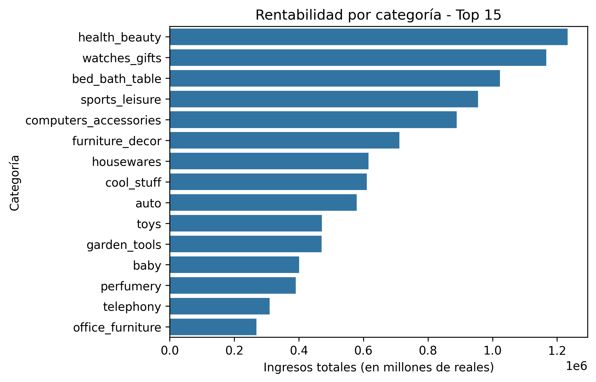
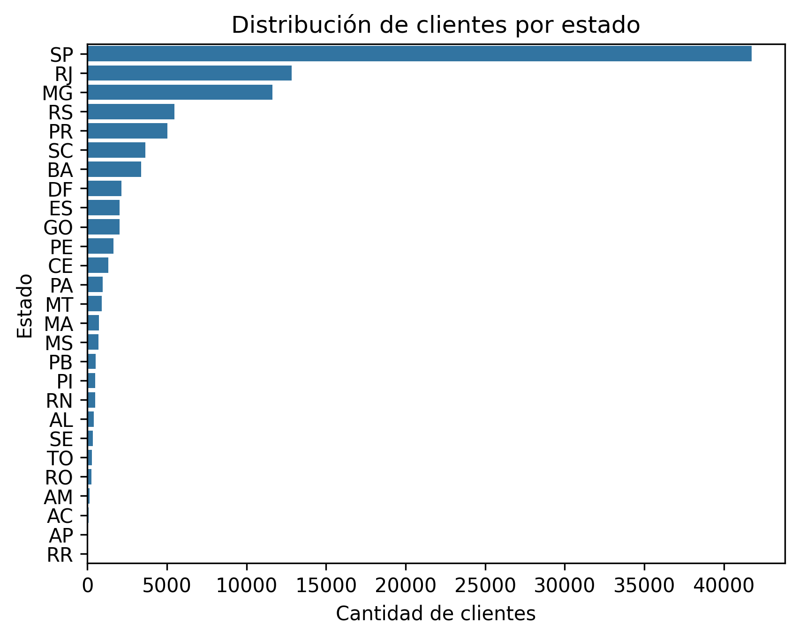
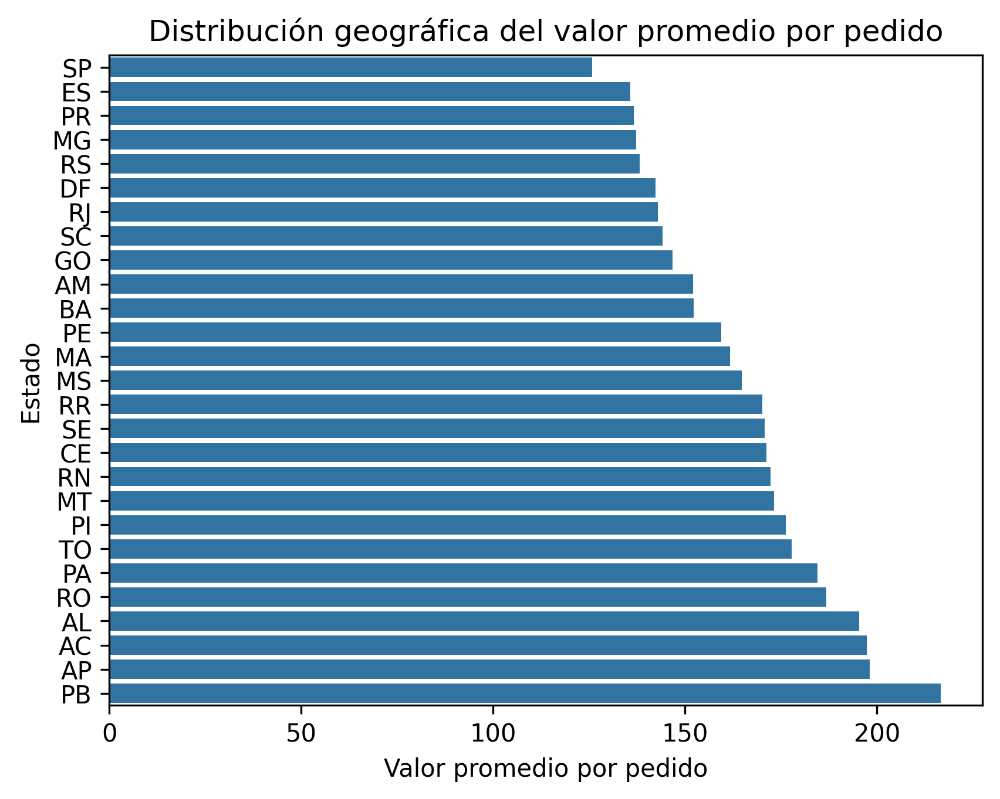

#  Proyecto de Análisis de E-Commerce Brasileño

## Descripción del Proyecto
Este proyecto analiza un dataset de 100k pedidos del marketplace brasileño Olist para revelar insights sobre la rentabilidad de productos, la demografía de los clientes y el rendimiento de ventas regional.
Como producción final, desarrollé el siguiente dashboard: lookerstudio.google.com/reporting/3adb6b2c-54e7-46c6-a49a-4ca00882a2df. 

## Gráficos

### 1. Categorías con Mayores Ingresos
 **Health & Beauty** (Salud y Belleza), **Watches** (Relojes) y **Bed/Bath/Table** (Cama, Mesa y Baño) son los principales generadores de ingresos.

*(Top 15 categorías por ingresos totales en Millones de BRL)*

### 2. Demografía
La región Sureste supera ampliamente al resto. **São Paulo (SP)** representa la mayor parte de los pedidos, seguido por Río de Janeiro (RJ) y Minas Gerais (MG).

### 3. Valor Económico por Región (Ticket Promedio)
La relación aparentemente inversa entre cantidad de pedidos por región y el precio promedio indica un comportamiento de grandes compras en un mismo envío en regiones más aisladas.

### 4. Dashboard final
Apliqué la información para crear un dashboard en el que filtrar fácilmente por categoría y ver los resultados en un Heatmap.

##  Tecnologías y Herramientas

* **SQL:** Utilizado para la extracción de datos complejos.
    * Operaciones `JOIN` a través de 7 tablas relacionales (`orders`, `items`, `products`, `translations`, etc.).
    * Agregaciones (`SUM`, `COUNT`, `AVG`) y Agrupamientos (Grouping) para KPIs.
* **Python:** Utilizado para el procesamiento de datos y visualización.
    * **Pandas:** Limpieza y manipulación de datos.
    * **NumPy:** Gestión de tipos en el pipeline.
    * **Seaborn/Matplotlib:** Creación de gráficos.
* **Looker Studio:**  dashboard.

##  Contacto
* **Nombre:** Joaquín Bermúdez Aletti
* **LinkedIn:** linkedin.com/in/joaquinbrm
* **Portafolio:** github.com/joaquinbrm/
